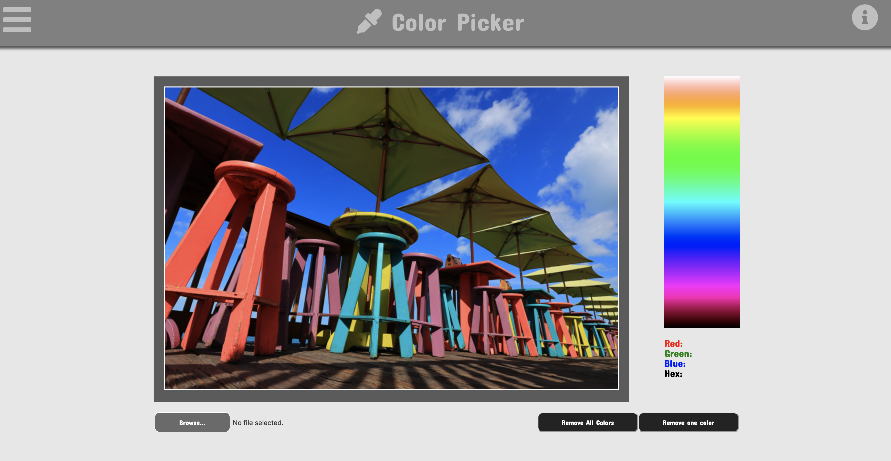

# Color Picker

---
Click [here](https://arwensookim.github.io/color-picker/) for live demo

## **Background**

This will help you to get color code from pictures you uploaded.
Once you upload the picture, you can click the spot/pixel to get specific code for corresponding color.

## **Color Picker**




## **Functionality & MVPs**

In **Color Code Extraction**, users will be able to:
- can upload picture
- can click picture to get color code of specific pixel
- can see exact color for pixel, and average color for the pixel
- have color graph for more color code information


In addition, this project will include:
- A production README


## **Wireframes**


* can upload picture on the main box, and can see the uploaded picture.
* color graph is clickable and when the color been clicked, color code will be shown at the bottom of the color code box.
* picture is also clickable, and show rgb code corresponed to the selected pixel


## **Technologies, Libraries, APIs**

* `canvas` to draw image
* `html`, `css`, `JavaScript`, `rgb`


## **Feature**
User can upload picture and get average and exect pixel of color code.
Once user click the pixel of picture, color box will added bottom of the picture. Remove button will either **remove all boxes** that were added, or user can remove **only one last** color box.

```Javascript
getPixel(ev) {
    let cols = APP.canvas.width;
    let { offsetX, offsetY } = ev;
    let c = APP.getPixelColor(cols, offsetY, offsetX);
    let clr = `rgb(${c.red}, ${c.green}, ${c.blue})`; 

    APP.pixel = clr;
    APP.getAverage(ev);
  }
  ```


## **Implementation Timeline**
- **Friday Afternoon & Weekend:** Set up project, including getting webpack up and running. Get Color and spending time to play with API to get comfortable using it. 

- **Monday:** Hopefully start implementng layouts of pages and work on visualizing base webpage.

- **Tuesday:** Dedicate toward implementing the underlying logic of color extraction. Working on ajax to render page when actioned. Make sure all the action render correctly.

- **Wednesday:** Focus implementing manipulation. Make sure manipualation works properly only the part we selected with selected color.

- **Thursday Morning:** Try wrap up everything and see everything works properly, and try to update proposal if anything new added or updated.
